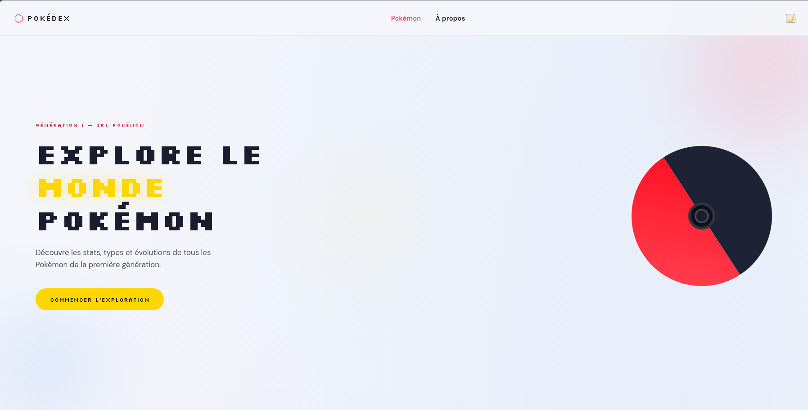
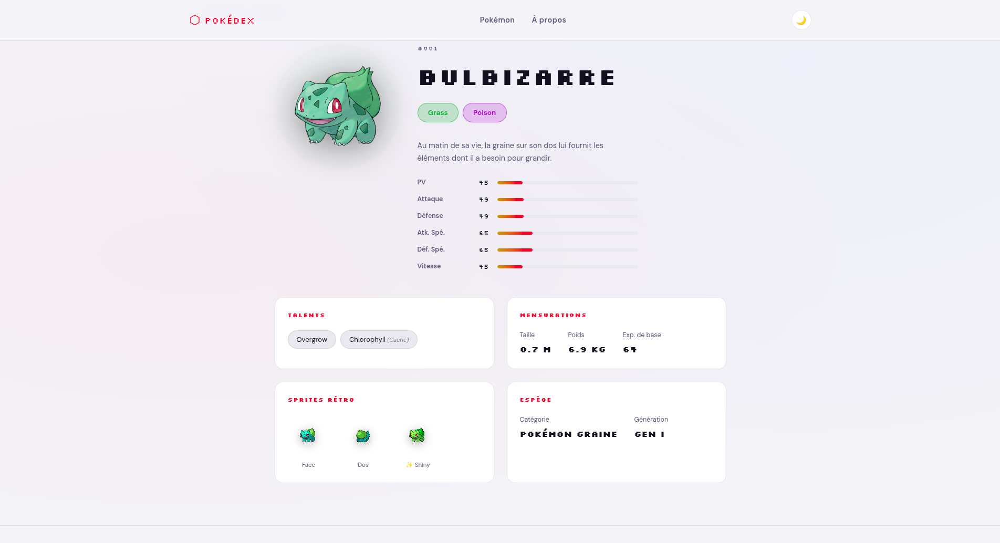
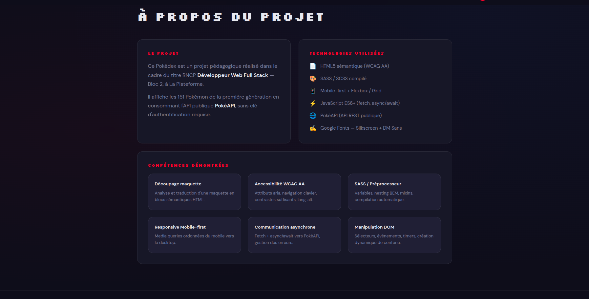

# 🎮 Application web dynamique connectée à une API publique — Projet pédagogique Bloc 2 RNCP Niveau 5


# 🔴 PokéDex — Application Web Front-End

## 📌 Présentation

Ce Pokédex est un projet pédagogique réalisé dans le cadre du titre RNCP Développeur Web Full Stack Niveau 5 (Bac+2) — Bloc 2 :  
**Développer des interfaces Frontend pour un site ou une application Web/Web Mobile**, à **La Plateforme**.

L’application affiche les **151 Pokémon de la première génération** en consommant l’API publique **PokéAPI**, sans clé d’authentification.

Le projet est entièrement :

- ⚡ Dynamique
- 📱 Responsive
- ♿ Accessible (WCAG AA)
- 🌙 Compatible Dark / Light mode

🎯 **Objectif pédagogique :** démontrer la maîtrise du développement front-end moderne avec :

- HTML5 sémantique
- SASS / SCSS
- JavaScript ES6+
- Fetch API & async/await
- Manipulation DOM
- Responsive Design
- Accessibilité WCAG AA

---

# 🎨 Maquettes & Wireframes

## 🖼️ Maquettes haute fidélité

### Accueil / Détail


### Variantes Desktop & Mobile


---

## 📐 Wireframes basse fidélité


Les maquettes couvrent :

- 🏠 Page d’accueil
- 🔍 Page détail Pokémon
- 💻 Version Desktop
- 📱 Version Mobile
- 🌙 Mode sombre
- ☀️ Mode clair
- 🎨 Wireframes en niveaux de gris

---

# ⚙️ Fonctionnalités

## 🃏 Grille dynamique de Pokémon

- Affichage dynamique des 151 Pokémon
- Utilisation de `fetch()` + `async/await`
- Animation d’apparition progressive avec `setTimeout`
- Couleur des cartes adaptée au type principal

---

## 🔍 Recherche & Filtres

- Recherche temps réel :
  - Nom FR
  - Nom EN
  - Numéro Pokédex
- Filtres par type :
  - Feu
  - Eau
  - Plante
  - Électrik
  - Psy
  - Normal
- Gestion d’état vide avec bouton de réinitialisation

---

## 📄 Page de détail Pokémon

- Navigation via `URLSearchParams`
- Stats animées progressivement
- Sprites rétro
- Talents
- Taille / poids
- Description française
- Données espèce via endpoint `pokemon-species`

---

## 🌙 Mode sombre / clair

- Thème sauvegardé avec `localStorage`
- Détection des préférences système
- Script anti-flash dans le `<head>`

---

## ♿ Accessibilité WCAG AA

- `lang="fr"`
- `meta viewport`
- `alt` sur toutes les images
- `aria-live`
- `aria-label`
- Navigation clavier complète
- Focus visible
- `role="progressbar"` pour les statistiques

---

## 🔊 Audio

- Son 8-bit généré avec Web Audio API
- Élément `<audio>` présent dans le HTML

---

# 📂 Structure du projet

```bash
pokedex/
│
├── index.html
├── style.css
├── package.json
├── README.md
│
├── sass/
│   └── style.scss
│
├── js/
│   ├── script.js
│   ├── detail.js
│   └── theme.js
│
├── pages/
│   ├── detail.html
│   └── about.html
│
├── design/
│   ├── maquette pokedex.png
│   ├── maquette pokedex2.png
│   └── wireframe pokedex.png
│
└── docs/
    ├── accueil.png
    ├── accueil2.png
    ├── detail.png
    └── about.png
```

---

# 🛠️ Technologies utilisées

| Technologie | Rôle |
|---|---|
| HTML5 sémantique | Structure du site |
| SASS / SCSS | Architecture CSS |
| CSS Grid & Flexbox | Responsive layout |
| JavaScript ES6+ | Dynamique & interactions |
| PokéAPI | Source de données |
| Web Audio API | Audio 8-bit |
| Google Fonts | Typographie |
| WCAG AA | Accessibilité |
| BEM | Convention CSS |

---

# 🚀 Installation & lancement

## 📦 Prérequis

- Node.js
- Navigateur moderne
- Live Server recommandé

---

## 🔧 Installation

```bash
git clone https://github.com/alexis-noiret/pokedex-bloc2.git

cd pokedex-bloc2

npm install
```

---

## 🎨 Compilation SASS

### Compiler une fois

```bash
npm run sass:build
```

### Compiler automatiquement

```bash
npm run sass
```

---

## ▶️ Lancement

Ouvrir `index.html` avec Live Server.

---

# ✅ Compétences Bloc 2 démontrées

## 🧱 HTML sémantique

Utilisation cohérente des balises :

- `<header>`
- `<nav>`
- `<main>`
- `<section>`
- `<article>`
- `<footer>`

Hiérarchie logique des titres `<h1>` → `<h2>`.

---

## 📱 Responsive Design

Approche mobile-first :

- Mobile → `repeat(2, 1fr)`
- ≥ 480px → `repeat(3, 1fr)`
- ≥ 768px → `repeat(4, 1fr)`
- ≥ 1024px → `repeat(6, 1fr)`

---

## 🎨 SASS / SCSS

- Variables
- Nesting
- Mixins
- Boucles `@each`
- Architecture BEM

---

## ⚡ JavaScript ES6+

- `fetch()`
- `async/await`
- `Promise.all()`
- `setTimeout()`
- Manipulation DOM
- Événements
- `URLSearchParams`

---

## 🌐 Communication asynchrone

Endpoints utilisés :

```txt
GET /pokemon?limit=151&offset=0
GET /pokemon/{id}
GET /pokemon-species/{id}
```

Gestion des erreurs avec `try/catch`.

---

## ♿ Accessibilité WCAG AA

- Navigation clavier
- Focus visible
- Contrastes lisibles
- Attributs ARIA
- Validation W3C

---

# 🌐 API utilisée

## PokéAPI

🔗 https://pokeapi.co

- API REST publique
- Gratuite
- Sans authentification
- Réponses JSON

---

# 📸 Aperçu de l’application

## 🏠 Page d’accueil



---

## 🔍 Page détail Pokémon



---

## 📄 Grille filtrée


---

## ℹ️ Page À propos



---

# 👨‍💻 Auteur

## Alexis Noiret

🎓 Étudiant en Bachelor IT — La Plateforme

🔗 GitHub :  
https://github.com/alexis-noiret

---

# 🎓 Contexte pédagogique

Projet réalisé dans le cadre du :

**Titre RNCP N°37273 — Développeur Web Full Stack — Niveau 5 (Bac+2)**

## Bloc 2

Développer des interfaces Frontend pour un site ou une application Web/Web Mobile.

🏫 École : **La Plateforme — La grande école du numérique pour tous**

---

# ⚠️ Disclaimer

Projet réalisé à des fins pédagogiques.

Pokémon © Nintendo / Game Freak.

Données fournies par PokéAPI.
